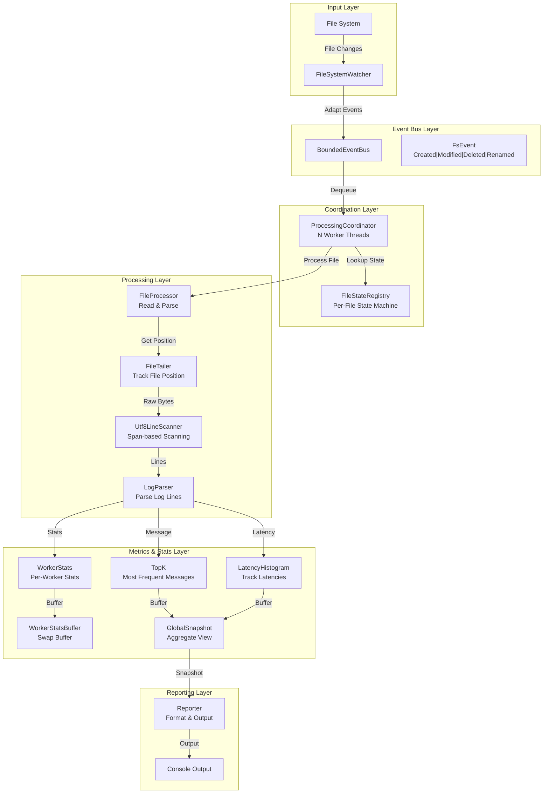

# LogWatcher

**Real-time log statistics for .NET without external dependencies.**

[](https://github.com/jvspeed74/LogWatcher/actions/workflows/ci.yml)
[](https://dotnet.microsoft.com/)
[](#license)

> [Insert console output GIF or screenshot here]

---

## Why This Exists

Built as a learning project alongside SAA-C03 preparation to develop hands-on intuition for system design tradeoffs —
specifically consistency models, backpressure, and memory management. A log monitoring tool turned out to be a useful
forcing function: it's simple enough to build solo, but hard enough to get right that every design decision has a real
consequence.

---

## Technical Highlights

- **Span-based zero-allocation hot path** — UTF-8 line parsing uses `ReadOnlySpan<byte>` with pooled buffers to minimize
  GC pressure in the parsing loop
- **Double-buffer swap protocol** — Lock-free stats collection between N worker threads and the reporter thread using
  atomic buffer exchanges and interval-based snapshots
- **Drop-newest backpressure** — Bounded event queue with deterministic metrics visibility; when full, new events are
  dropped with explicit reporting, not silently deferred
- **Safe file deletion handling** — Epoch-based file tracking prevents crashes on delete/rename races;
  `FileStateRegistry` maintains consistency across concurrent workers
- **Per-worker stats aggregation** — Each worker accumulates local counters independently, reducing contention versus a
  shared global counter; buffers are merged at report time

---

## Architecture



---

## Usage

```bash
dotnet run --project LogWatcher.App -- <watchPath> [options]
```

| Argument/Option         | Description                                      | Default    |
|-------------------------|--------------------------------------------------|------------|
| `watchPath`             | Directory path to watch for log file changes     | (required) |
| `--workers, -w`         | Number of worker threads for parallel processing | CPU count  |
| `--queue-capacity, -q`  | Maximum capacity of the filesystem event queue   | 10,000     |
| `--report-interval, -i` | Interval between console output (seconds)        | 2          |
| `--topk, -k`            | Number of most-frequent messages to track        | 10         |

```bash
dotnet run --project LogWatcher.App -- ./logs --workers 8 --queue-capacity 50000 --report-interval 1
```

### Docker Compose

To run the application with a sample log generator using Docker Compose, use the following command:

```bash
docker compose up --build
```

---

## Key Design Decisions

For a full breakdown see [`docs/technical_specification.md`](docs/technical_specification.md) and [
`docs/thread_lifecycle.md`](docs/thread_lifecycle.md).

---

## License

MIT