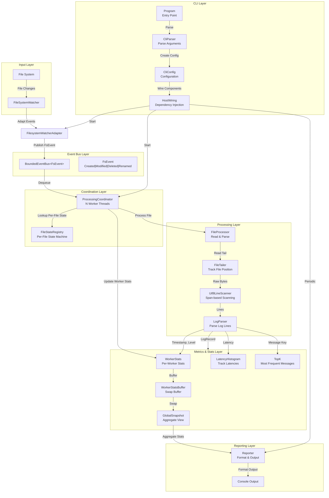
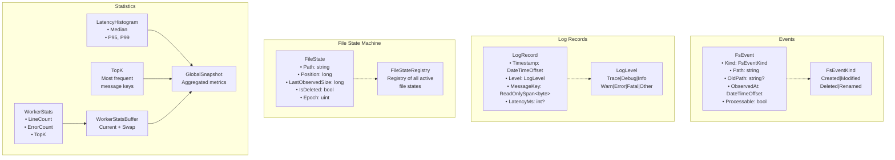
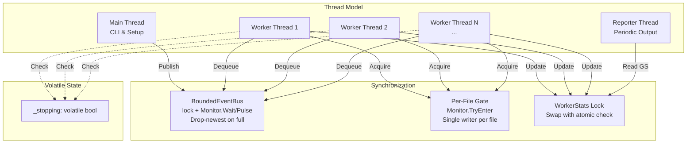
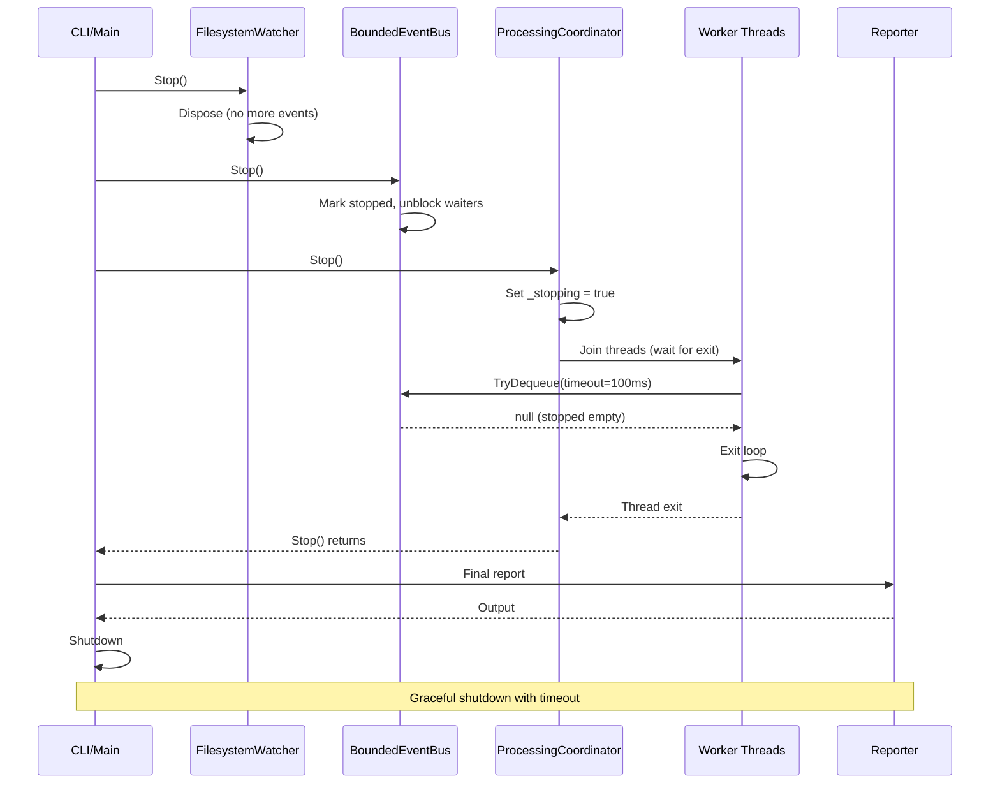
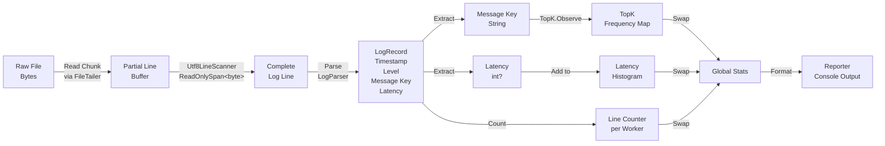
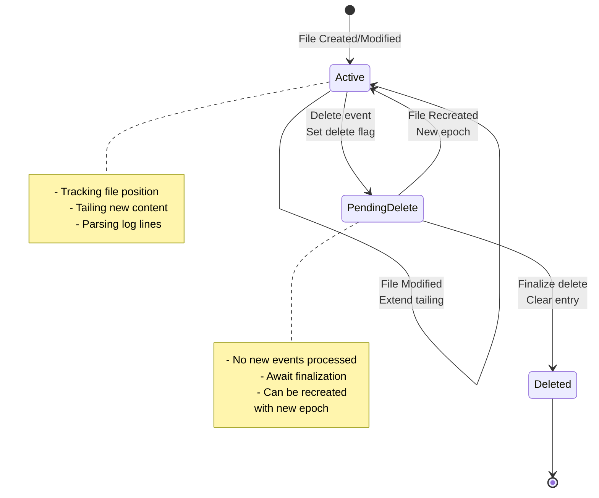
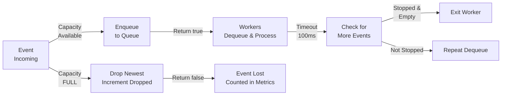

# LogWatcher System Diagram

## High-Level Architecture

## Component Interactions - Detailed Flow

```mermaid
graph LR
    subgraph Ingestion["① Ingestion"]
        A["FileSystem<br/>Changes"]
        B["FSWatcherAdapter"]
        C["BoundedEventBus"]
    end

    subgraph Dequeue["② Dequeue"]
        D["ProcessingCoordinator<br/>Worker Threads"]
    end

    subgraph Lookup["③ Lookup State"]
        E["FileStateRegistry"]
        F["FileState<br/>Per File"]
    end

    subgraph Read["④ Read & Tail"]
        G["FileProcessor"]
        H["FileTailer<br/>Track Position"]
    end

    subgraph Parse["⑤ Parse"]
        I["Utf8LineScanner<br/>ReadOnlySpan&lt;byte&gt;"]
        J["LogParser<br/>Extract Fields"]
    end

    subgraph Aggregate["⑥ Aggregate"]
        K["WorkerStats"]
        L["TopK Queue"]
        M["LatencyHistogram"]
    end

    subgraph Report["⑦ Report"]
        N["GlobalSnapshot<br/>Swap"]
        O["Reporter"]
        P["Console Output"]
    end

    A -->|Create/Modify/Delete/Rename| B
    B -->|FsEvent| C
    C -->|Dequeue<br/>Timeout| D
    D -->|Lookup| E
    E -->|State| F
    D -->|Read File| G
    G -->|Get Position| H
    H -->|New Bytes| I
    I -->|LogRecord| J
    J -->|Stats| K
    J -->|Message| L
    J -->|Latency| M
    K -->|Swap Buffer| N
    L -->|Swap Buffer| N
    M -->|Swap Buffer| N
    N -->|Global Stats| O
    O -->|Formatted| P

```

## Data Structures

## Concurrency Model

## Shutdown Sequence

## Data Flow - Processing a Log Line

## File State Machine

## Queue Behavior - BoundedEventBus

